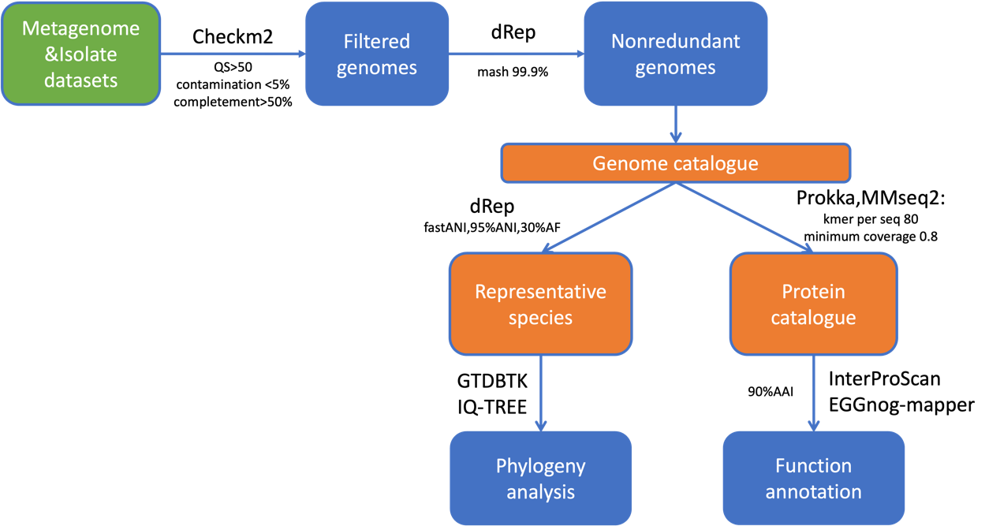

[](https://www.nextflow.io/)
[](https://www.docker.com/)


# genome-catalogue-pipeline

## Introduction

**genome-catalogue-pipelines** is an automated data analysis workflow designed for large-scale metagenomic species and functional analysis on high-performance computing clusters. 

<p align="center">
    
</p>

## Pipeline summary

This pipeline is implemented in Nextflow. The core functions and steps are as follows:
- Imports genome data from public databases (SPIRE, Progenomes3, Mgnify, etc.) or assembled MAGs and isolate genomes.
- Performs quality control using [CheckM2](https://github.com/chklovski/CheckM2), filtering out genomes with high or medium quality.
- Removes redundancy by applying the [dRep](https://github.com/MrOlm/drep) with MASH algorithm at **99.9%** ANI threshold, constructing the **genome catalogue**.
- Cluter to species clusters (SGBs) using dRep's fastANI algorithm at **95%** ANI threshold and selects **representative genomes (SRs)** based on genome completeness, contamination, N50, and genome type.
- Builds a protein catalogue by annotating genomes using [Prokka](https://github.com/tseemann/prokka) and clustering protein sequences using [MMseqs2](https://github.com/soedinglab/MMseqs2) at 50%, 90%, and 100% amino acid identity. Protein domains are annotated with [InterProScan](https://github.com/ebi-pf-team/interproscan) and gene functions with [eggNOG-mapper](https://github.com/eggnogdb/eggnog-mapper).
- Performs phylogenetic analysis using [GTDB-Tk](https://github.com/Ecogenomics/GTDBTk) for taxonomy assignment and [IQ-TREE2](https://github.com/iqtree/iqtree2) for phylogenetic tree construction of representative genomes (SRs).

> [!NOTE]
> When performing quality control on the obtained genomes, make sure to retain **high-quality** or **medium-quality** genomes by specifying the `--quality_filter` before running the workflow on actual data. High-quality :completeness > 90%, contamination < 5%;medium-quality:completeness > 50%, contamination < 5%, and  QS > 50. (QS = % completeness - 5 * % contamination).

> [!NOTE]
> If you only want to get species clusters (SGBs) ,representative genomes,add `--skip_annotation` parameter,default run annotation

## Data preparation
### Input genomes specifications

The input data can be passed to this pipeline using the `--input_genomes` parameter ,and you need to prepare all your genomes into a directory and make sure all extension with **".fna.gz"** . 

### Samplesheet input file

You need to provide a TSV samplesheet input file using the `--input_genomes_metadata` parameter and TSV with atleast four columns:**genome**,**type(MAG or isolate)**, **completeness** ,**contamination** . However, if the quality statistics for the genomes is unavailable, you can add `--run_checkm2` to run CheckM2 and generate the related information columns. 


Additionally, you will need the following information to run the pipeline:

 - prefix genome name (for example, BIFIDO)
 - catalogue version (for example, 1.0)
 - min and max accession number to be assigned to the genomes . Max - Min = #total number of genomes
 - save genomes quality level (medium or high quality)
 - drep cluster method (for example, fastANI)

> [!NOTE]
> There are several dRep supported clustering algorithms. Please refer to [Overview of genome comparison algorithms](https://drep.readthedocs.io/en/latest/choosing_parameters.html#oddities-of-hierarchical-clustering) on clustering algorithms. Make sure to choose cluster method with `--drepcluster_method` before running the workflow on actual data.

## Usage


The pipeline is built in Nextflow, and utilized docker container to run the software. The typical command for running the pipeline is as follows:

```bash
nextflow run genome-catalogue-pipeline/main.nf -profile docker -c custom.config  \
--input_genomes input_genomes \
--input_genomes_metadata metadata.tsv \
--outdir /mnt/chenwen/02.program/check_genome_catalog_pipeline/01.results \
--start_number 1 \
--end_number 10000 \
--version 1.0 \
--genome_prefix BIFIDO \
--drepcluster_method fastANI \
--quality_filter medium \
```

> [!NOTE]
> If you need to perform re-clustering on the resulting species clusters,  add `--run_recluster` parameter . This is  because dRep may assign some genome pairs with an ANI greater than the threshold end up in different clusters. The re-clustering process will allow you to recluster and choose new representative genomes.

> [!WARNING]
> For the subsequent update-catalogue pipeline, you can choose to skip phylogenetic analysis by adding  `--skip_gtdb` and `--skip_tree` parameters, as not every update results in new species or replaces representative genomes. 

## Tools used in the pipeline
| Tool/Database                                                                                    | Version           | Purpose                                                                                                                |
|--------------------------------------------------------------------------------------------------|-------------------|------------------------------------------------------------------------------------------------------------------------|
| CheckM2                                                                                          | 1.0.1             | Determining genome quality                                                                                             |
| dRep                                                                                             | 3.2.2             | Genome clustering                                                                                                      |
| Mash                                                                                             | 2.3               | Sketch for the catalogue; placement of genomes into clusters (update only); strain tree                                |
| GTDB-Tk                                                                                          | 2.4.0             | Assigning taxonomy; generating alignments                                                                              |
| GTDB                                                                                             | r220              | Database for GTDB-Tk                                                                                                   |
| Prokka                                                                                           | 1.14.6            | Protein annotation                                                                                                     |
| IQ-TREE 2                                                                                        | 2.2.0.3           | Generating a phylogenetic tree                                                                                         |
| MMseqs2                                                                                          | 13.45111          | Generating a protein catalogue                                                                                         |
| eggNOG-mapper                                                                                    | 2.1.11            | Protein annotation (eggNOG, KEGG, COG,  CAZy)                                                                          |
| eggNOG DB                                                                                        | 5.0.2             | Database for eggNOG-mapper                                                                                             |
| Diamond                                                                                          | 2.0.11            | Protein annotation (eggNOG)                                                                                            |
| InterProScan                                                                                     | 5.62-94.0         | Protein annotation (InterPro, Pfam)                                                                                    |
| run_dbCAN                                                                                        | 4.1.2             | Polysaccharide utilization loci prediction                                                                             |
| dbCAN DB                                                                                         | V12               | Database for run_dbCAN                                                                                                 |
